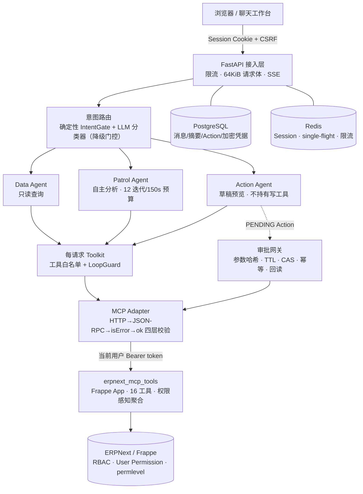

# ERPNext Agent

基于 AgentScope 2.0 的 ERPNext 智能业务 Agent 服务：自然语言完成查询、分析与巡检，所有写操作
经过持久化人工审批（HITL），并以权限透传、双层评估和可审计的工程基线为设计核心。


> 个人独立开发项目，本地部署于真实 ERPNext 实例完成端到端验收；不含任何真实企业数据与凭据。

## 它解决什么问题

让 ERPNext 用户用自然语言在**本人权限范围内**查询业务数据、分析异常、创建/修改单据草稿。
例如："物料组为原材料库存低于 15 的物料"、"本月销售订单环比上个月怎么样"、"逾期应收巡检并
给出跟进建议"。

与常见 LLM Demo 的区别：

1. **权限不是提示词请求，是代码边界。** 浏览器只持有 Agent Session Cookie；ERPNext OAuth token
   信封加密存储、每请求透传到 MCP；Data/Patrol/Action 的工具持有在构造期物理隔离；所有写操作
   走数据库持久化审批状态机（参数哈希绑定 → 本人确认 → CAS 执行 → 固定幂等键 → `get_doc`
   回读 `docstatus=0`）。跨用户审批、幂等键注入、提示词诱导写入都有对应的安全负样本测试。
2. **Agent 质量用数字说话。** 28 项离线确定性策略评估（意图路由/工具隔离/参数校验/响应信封，
   零外部依赖可复现）+ 26 项在线真实链路评估（真实 OAuth 双用户 + 真实 ERPNext 数据 + 草稿
   全生命周期含测试数据清理），输出逐场景证据、分类通过率与稳定退出码契约。
3. **"更像 Agent"是实验出来的，不是喊出来的。** Patrol Agent 按五步方法论自主决定取数计划
   （界定问题→最小证据集→自适应查询→确定性计算→带证据结论）；环比/占比等百分比一律经本地
   确定性计算工具，禁止模型心算；实测发现并修复了"日期上下文以会话消息注入导致模型跳过工具
   直接作答"（5 轮探针 4 次复现）、"空列表被收敛中间件锁死成错误答案"、"UI 翻译物料组名
   （原材料 ← docname `Raw Material`）解析失败"等真实问题；DashScope 兼容模式将
   `tool_choice=required` 静默降级为 `auto`，因此未取证数字采用运行时 fail-closed 护栏兜底。
4. **生产级工程基线，但边界诚实。** Alembic 迁移门禁与 ORM drift 检查、OpenTelemetry 隐私链路
   （token/Prompt/业务正文永不进 Trace）、Action 重启恢复与会话保留后台 Worker、只读非 root
   容器镜像——同时明确记录已知限制（见文末）。

## 架构



每请求装配（无跨请求共享状态）：解析会话与凭据 → 到期前主动刷新（Redis 分布式租约
single-flight）→ `tools/list` 契约校验（严格集合相等，fail-closed）→ 按意图物理构建 Toolkit →
Agent 执行 ReAct 循环 → 助手回复落库。会话记忆为版本化增量摘要（Redis 锁 + 序列号防过时写回），
原始消息完整保留并支持保留策略清理。

## 评估体系

| 套件 | 模式 | 覆盖 | 最近结果（2026-08-29） |
|---|---|---|---|
| `offline_policy_v1` | 确定性、零外部依赖 | 意图路由、上下文继承、读写工具隔离、草稿参数校验、MCP 业务信封失败关闭 | 28/28，安全违规 0 |
| `online_authenticated_v1` | 真实 OAuth 双用户 + 真实 ERPNext | 工具选择正确性、领域聚合、草稿提案→批准→执行→回读→清理、跨用户隔离 404、低权限边界、翻译组名/相对时间 | 26/26 × 3 轮，安全违规 0 |

离线套件以退出码契约（0/1/2/3）接入 CI；在线套件缺 fixture 环境变量时失败关闭并列出补救项。
两类报告强制携带免责声明：离线数字不代表真实模型质量，在线数字仅代表该评估集。

真实输出摘录（在线报告证据字段，dev 演示数据）：

> **环比分析**（`online_analysis_period_change`，patrol 路由，工具序列 `get_count → get_count → erpnext_analytics`）：
> 本月（2026-08-01 至 2026-08-31）2 单，上月（2026-07-01 至 2026-07-31）0 单——
> "基期为 0，无法计算有效百分比，仅能确认绝对变化 +2 单"，并给出 1 条后续巡检建议。

> **物料组低库存**（`online_item_group_low_stock`，单次 `erpnext_get_item_group_low_stock`，
> 无逐物料 N+1）：按 (物料组含全部子组, 当前用户可见叶子仓库, 严格小于阈值) 返回并引用 scope。

## 快速开始

要求：Python 3.12、uv、Docker Compose，以及一个可访问的 ERPNext 实例（MCP 服务端为本仓库的
姊妹项目 [erpnext_mcp_tools](https://github.com/Arui-world/erpnext_mcp_tools)）。

```bash
cp .env.example .env          # 填写模型、ERPNext 与 OAuth Client；密钥生成方式见模板注释
uv sync --frozen
make rebuild                  # 构建镜像；一次性 migrate Job 成功后 Agent 才启动
make eval                     # 离线策略评估（无需任何外部服务）
make eval-online              # 在线真实链路评估（需 EVAL_ONLINE_* fixture 与两个已登录用户）
```

打开 `http://localhost:8001/` 登录 ERPNext 即可对话；`curl localhost:8001/health/ready`
查看能力位与迁移 revision。可选 `--profile observability` 启动 OTel Collector + Jaeger。

## 已知限制（诚实边界）

- 单人项目，本地 dev 实例端到端验收，**无真实生产流量与并发验证**；
- 草稿执行接口存在已记录的偶发 409（decision/execute 跨请求事务可见性竞态，三轮全量评估未
  复现，见[开发进度](docs/ERPNext-Agent-开发进度.md) §四）；
- 写能力仅白名单草稿（创建/更新），无 submit/cancel/delete——这是设计决定而非疏漏；
- 长期记忆（ReMe 工具轨迹经验层）已完成方案评估但**未实现**；
- 单实例部署假设；多副本需要解决本地文件与会话粘性。

## 技术栈

[AgentScope 2.0](https://github.com/agentscope-ai/agentscope) · FastAPI · PostgreSQL · Redis ·
[Model Context Protocol](https://modelcontextprotocol.io/) · Frappe/ERPNext · SQLAlchemy/Alembic ·
OpenTelemetry · Docker Compose · Pytest/Ruff/Mypy

## License

[MIT](LICENSE)
