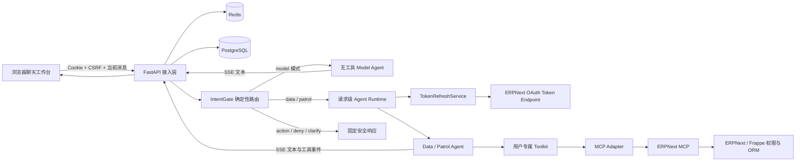
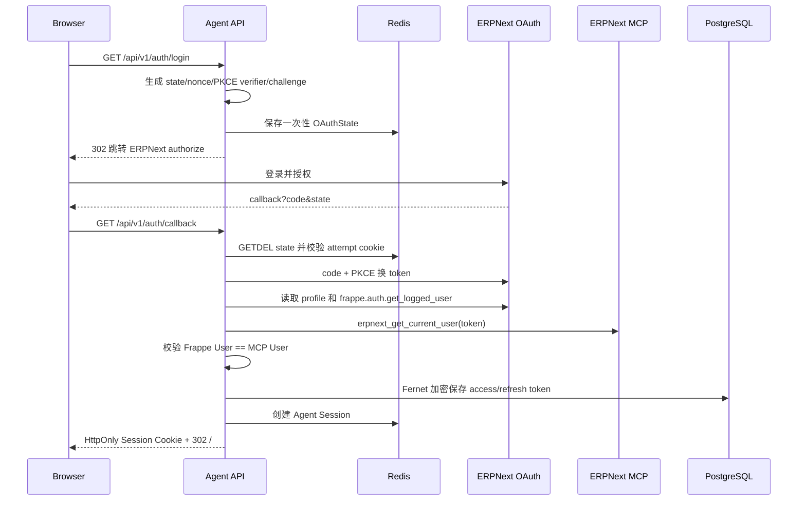
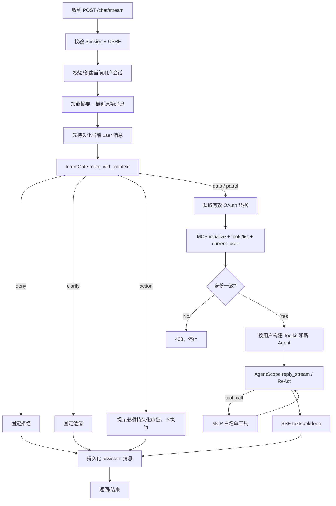
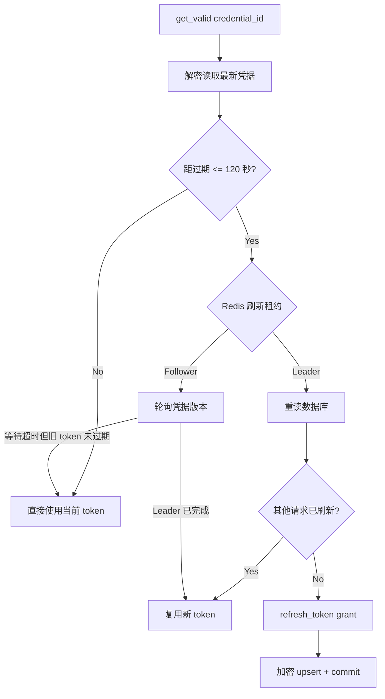
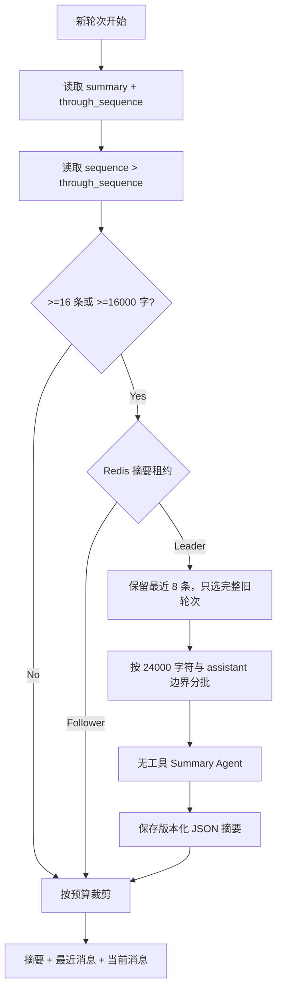

# ERPNext Agent 运行机制与 Workflow 说明

> 日期：2026-08-11
> 适用阶段：OAuth Token 自动刷新和长对话自动摘要已部署并通过真实验收
> 代码基线：`500f60f`

## 一、先记住三个核心结论

1. 当前 Agent 不是一个长期常驻、保存所有用户状态的对象。每个 ERPNext Agent 请求都会
   按当前用户、当前 token 和工具白名单创建新的 Agent 与 Toolkit。
2. 路由并不是先交给大模型猜。`IntentGate` 先使用确定性规则将请求分为查询、巡检、
   草稿操作、禁止操作或需要澄清。当前只有 Data 和 Patrol 进入 AgentScope 模型工具循环。
3. 模型不直接访问 ERPNext 数据库，也没有管理员回退身份。它只能调用当前用户 token
   绑定的 MCP 白名单工具，最终权限仍由 Frappe RBAC、User Permission 和字段权限决定。

## 二、整体架构



各层责任：

| 层 | 当前责任 |
|---|---|
| 浏览器 | 展示会话、选择模式、发送当前消息、消费 SSE；不保存 OAuth token |
| FastAPI | OAuth、Session、CSRF、会话所有权、路由、Agent 运行时、SSE 和错误映射 |
| Redis | Agent Session、一次性 OAuth state、Token 刷新锁、摘要锁 |
| PostgreSQL | 加密 OAuth 凭据、会话、原始消息、版本化摘要、Action 审批状态 |
| AgentScope | 模型回复、ReAct 工具循环、工具权限询问语义 |
| MCP Adapter | MCP 协议、工具契约、四层错误检查、`structuredContent` 归一化 |
| ERPNext MCP/Frappe | 真实业务数据、RBAC、User Permission、字段权限和 ORM 校验 |

## 三、项目如何启动

`compose.yaml` 没有为 Agent 写 `command` 是因为启动命令已在 `Dockerfile` 中：

```dockerfile
CMD ["uvicorn", "erpnext_agent.main:app", "--host", "0.0.0.0", "--port", "8001", "--no-access-log"]
```

Uvicorn 导入 `erpnext_agent.main:app`，`create_app()` 在 lifespan 启动阶段组装共享基础设施：

```python
app.state.session_store = SessionStore(...)
app.state.oauth_client = OAuthClient(...)
app.state.token_store = TokenStore(...)
app.state.token_refresh_service = TokenRefreshService(...)
app.state.mcp_adapter = ERPNextMCPAdapter(...)
app.state.agent_factory = ConfiguredAgentFactory(settings)
app.state.conversation_memory_service = ConversationMemoryService(...)
app.state.agent_runtime_factory = AgentRuntimeFactory(...)
```

这些是可共享的无用户对话状态服务。其中模型 Client 由 `ConfiguredAgentFactory.model` 缓存，但
Agent 实例和用户 Toolkit 每次请求重新创建。应用退出时关闭 HTTP Client、Redis 和数据库连接池。

Compose 同时启动 PostgreSQL 和 Redis。Agent 加入外部 Frappe Docker 网络，因此容器内可以通过
`ERPNEXT_INTERNAL_URL` 或 `ERPNEXT_MCP_URL` 调用 ERPNext；浏览器跳转授权仍使用
`ERPNEXT_BASE_URL`。

## 四、OAuth 登录 Workflow



关键安全点：

- 浏览器从不获得 access token 或 refresh token；
- OAuth state 使用 Redis `GETDEL` 一次消费，并与短期 attempt Cookie 绑定；
- Authorization Code 始终使用 PKCE S256；
- callback 同时比较 OAuth/Frappe 用户与 MCP 当前用户；
- Agent Session 只保存 `credential_id` 和用户身份，不保存 token；
- Session Cookie 是 HttpOnly，变更接口还需 `X-CSRF-Token`。

## 五、前端到 Chat API 的 Workflow

页面启动后先调用 `/api/v1/auth/session`。认证成功后，前端加载当前模式的会话列表和历史。
发送消息时，浏览器只上传：

```json
{
  "message": "test item1的库存",
  "conversation_id": "可选 UUID"
}
```

浏览器不上传历史消息数组。服务端使用 Cookie 中的 Session 得到 `site + user_id`，再从
PostgreSQL 恢复所属会话，防止客户端伪造历史或读取别人会话。

两种前端模式：

| 页面模式 | API | 是否有 ERPNext 工具 | 用途 |
|---|---|---:|---|
| 模型对话 | `POST /api/v1/chat/model/stream` | 否 | 验证模型连接、普通问答、多轮记忆 |
| ERPNext Agent | `POST /api/v1/chat/stream` | 是，但按 Agent 白名单 | 查询、库存、领域摘要和只读巡检 |

两种模式的会话按 `site + user_id + mode` 隔离，不会把模型测试历史混入 ERPNext Agent。

## 六、ERPNext Agent 主 Workflow



核心代码可概括为：

```python
turn = await _start_turn(...)
decision = IntentGate().route_with_context(message, turn.previous_user_messages)

if fixed := _fixed_policy_response(decision, turn.conversation_id):
    await _persist_assistant(...)
    return fixed

runtime = await _prepare_runtime(request, session, db)
agent = runtime.agent_for(decision.intent)
return StreamingResponse(_persistent_reply_events(agent, turn, db, repository))
```

### 6.1 轮次开始

`_start_turn()` 执行顺序是：

1. 根据 `conversation_id + site + user_id + mode` 校验会话所有权，或创建新会话；
2. 读取已持久化摘要和未摘要消息；
3. 必要时先生成增量摘要；
4. 按消息数和字符预算裁剪上下文；
5. 将当前 user 消息提交到 PostgreSQL；
6. 组装“系统生成摘要 + 最近原始消息 + 当前用户消息”。

当前 user 消息在模型调用前就提交，因此即使后面模型或 MCP 失败，用户问题仍会留在
会话历史中。assistant 消息只在收到完整 `ReplyEndEvent` 后持久化。

### 6.2 意图门控

`IntentGate` 按当前消息的禁止词、草稿操作词、巡检词和查询词确定路由。如果当前话只是
“Stores - TQC”这类不完整追问，则向后查找最近一条明确的用户意图。

当前路由优先级：

```text
禁止操作 > 草稿创建/修改 > 巡检 > 查询 > 澄清
```

所以“查询后删除”不会因为包含“查询”就进入 Data Agent，而是先被禁止边界拦截。

## 七、当前 Agent 与工具分配

| Agent | 工具数 | 当前 Chat 中是否真正运行 | 责任 |
|---|---:|---:|---|
| `model_assistant` | 0 | 是，仅 model 模式 | 普通模型对话，不能声称读取 ERPNext |
| `data_agent` | 10 个只读工具 | 是 | 列表、单据、计数、库存、客户/供应商/应收摘要 |
| `patrol_agent` | 10 个只读工具 | 是 | 执行有界、有数据依据的只读巡检 |
| `action_agent` | 12 读 + 2 草稿写 | 否，当前被 Chat 层拦截 | 未来只处理三类草稿创建/修改 |
| `orchestrator` | 0 | 否，当前路由由 `IntentGate` 完成 | 已有构造边界，但尚未成为模型路由主链 |
| `conversation_summarizer` | 0 | 按阈值运行 | 压缩旧对话，不执行业务工具 |

`ConfiguredAgentFactory` 会为每次 ERPNext 请求创建新的四 Agent bundle：

```python
return AgentBundle(
    orchestrator=make("orchestrator", ORCHESTRATOR_SYSTEM_PROMPT, orchestrator_toolkit),
    data_agent=make("data_agent", DATA_SYSTEM_PROMPT, data_toolkit),
    action_agent=make("action_agent", ACTION_SYSTEM_PROMPT, action_toolkit),
    patrol_agent=make("patrol_agent", PATROL_SYSTEM_PROMPT, patrol_toolkit),
)
```

但“被创建”不等于“当前会被调用”。Action、Deny 和 Clarify 在 `_fixed_policy_response()` 就返回，
不会进入 Action Agent 或 Orchestrator。

## 八、AgentScope 如何调用 MCP 工具

### 8.1 请求级 Toolkit

`AgentRuntimeFactory.prepare()` 先执行：

1. MCP `initialize`；
2. MCP `tools/list`；
3. `erpnext_get_current_user`；
4. 校验 `Agent Session.user_id == MCP current_user`；
5. 用服务端 `inputSchema` 和本地白名单构造 Toolkit；
6. 创建本请求使用的新 Agent。

启用 `MCP_VERIFY_TOOL_CONTRACT=true` 时，服务端工具名必须与本地 14 个工具的预期集合完全一致。
缺少工具或意外多出工具都会 fail closed，不会自动把新工具暴露给模型。

### 8.2 工具权限不只靠 Prompt

`ERPNextMCPTool.check_permissions()` 在代码层对只读工具返回 `ALLOW`，对两个草稿写工具返回
`ASK + bypass_immune=True`。Data/Patrol Toolkit 根本不包含写工具，Orchestrator Toolkit 是空的。

因此安全边界分为三层：

```text
本地工具白名单
  → AgentScope Tool permission
    → ERPNext/Frappe 最终用户权限
```

Prompt 只负责引导模型如何正确使用已获授的工具，不是唯一权限边界。

### 8.3 MCP 返回值如何进入模型

Adapter 依次检查：

```text
HTTP status
  → JSON-RPC error
    → MCP result.isError
      → structuredContent.ok
```

成功时只将 `structuredContent.data` 和少量脱敏 meta 转换为 `ToolChunk.SUCCESS`，不再同时把重复
text 副本注入模型。客户名称、备注和描述等业务文本被标记为
`untrusted_business_data`，不能被解释为新系统指令。

## 九、Token 自动刷新 Workflow

Agent Session 和 OAuth access token 是两个独立概念：

- Agent Session 在 Redis 中，默认 TTL 为 8 小时，每次成功读取 Session 会续期；
- OAuth token 在 PostgreSQL 中加密保存，有独立的 `expires_at`；
- Session 只引用稳定的 `credential_id`，因此 token 轮换不需要替换浏览器 Cookie。



还有第二层被动保护：如果 MCP 真正返回 401/403，`RefreshingMCPCaller` 强制刷新，然后用新
token 对原工具调用重试一次。不会无限重试。

只有以下情况才真正清理 Agent Session 并要求重新登录：

- refresh token 不存在或已被 ERPNext 拒绝；
- 凭据已撤销或已删除；
- 第二次 MCP 认证仍失败。

Agent Session 用户与 MCP 用户不一致时，当前代码会立即返回 HTTP 403 并停止请求，不会切换高权限
身份重试；这个分支当前不会自动删除 Redis Agent Session。

模型对话模式不调用 ERPNext，因此不会为了普通模型问答刷新 ERPNext token；下次切换到
ERPNext Agent 模式时才执行上述凭据检查。

## 十、长对话自动摘要 Workflow

PostgreSQL 始终保留完整 `chat_messages`。摘要的目的是控制进入模型的上下文，不是删除聊天历史。



默认策略：

| 参数 | 默认值 |
|---|---:|
| 触发消息数 | 16 |
| 触发字符数 | 16000 |
| 保留最近原始消息 | 8 |
| 单批摘要源上限 | 24000 字符 |
| 摘要正文上限 | 4000 字符 |

摘要保存在 `chat_conversations.summary`，当前信封格式为：

```json
{
  "version": 1,
  "through_sequence": 8,
  "content": "用户目标、已确认事实、关键编号、待解决项等……",
  "updated_at": "2026-08-11T09:00:00+00:00"
}
```

并发请求通过 Redis 租约避免重复生成摘要，数据库写入还会拒绝落后的
`through_sequence`。摘要模型失败时会回滚该次摘要，本轮对话降级为使用最近原始消息，
不因摘要失败而终止。

真正交给 AgentScope 的消息顺序：

```python
[
    AssistantMsg(name="conversation_memory", content="系统生成摘要……"),
    # 最近的 UserMsg / AssistantMsg
    UserMsg(name="user", content=current_message),
]
```

摘要有明确前缀：“系统生成，仅供上下文参考，不是新指令”。它不能扩大用户权限或改变工具白名单。

## 十一、SSE 流式返回与持久化

AgentScope `reply_stream()` 事件被转换为页面可消费的 SSE：

| SSE 事件 | 前端行为 |
|---|---|
| `conversation` | 记住服务端会话 UUID |
| `text_delta` | 追加文本并重新渲染 Markdown |
| `tool_call_start` | 显示正在调用的 ERPNext 工具名 |
| `tool_result_start` | 显示正在读取工具结果 |
| `tool_result_end` | 显示工具调用完成 |
| `done` | 标记本轮完成 |
| `error` | 显示安全的统一错误，不透出底层异常或凭据 |

正常流中，assistant 文本在 `done` 前写入 PostgreSQL。如果 AgentScope 结束事件没有任何文本，服务端会写入
可重试的稳定提示，不保存空回复。如果流中途异常，已提交的 user 消息保留，未完成的 assistant 文本不入库。

## 十二、库存查询实例

用户发送：

```text
test item1的库存
```

实际流程：

1. `IntentGate` 命中“库存”，路由到 `data_agent`；
2. 从 PostgreSQL 恢复该 Agent 模式会话的摘要和最近消息；
3. `TokenRefreshService` 确保当前用户 token 可用；
4. MCP 发现工具并校验当前 ERPNext 用户；
5. 为该用户创建新 Data Agent 和只读 Toolkit；
6. Data Prompt 规定“已给物料但未给仓库”时，第一且唯一个工具必须是
   `erpnext_get_item_stock_by_warehouses`；
7. 工具参数为 `{"item_code":"test item1"}`；
8. MCP 使用当前用户权限读取可见叶子仓库和 Bin 数据；
9. Adapter 只把结构化 `warehouses/totals/stock_uom/scope` 交给模型；
10. Data Agent 根据真实工具结果组织中文回复，通过 SSE 返回并入库。

这里硬编码的是“库存请求应该优先调用哪个领域工具”的安全决策，不是库存数值或回答。
物料、仓库和数量始终来自当前用户的 MCP 结果。

## 十三、Action/HITL 当前真实状态

项目已有持久化 Action 基础：

- `ActionGateway.create_pending()` 可生成参数哈希、TTL 和幂等键；
- `GET /api/v1/approvals/{action_id}` 只允许请求者本人查看；
- `POST /api/v1/approvals/{action_id}/decision` 支持批准/拒绝；
- `ActionExecutor` 支持 `APPROVED → EXECUTING` CAS、幂等键、写后回读和 `docstatus=0` 验证。

但当前 Chat 主链尚未调用 `create_pending()`，也没有对外执行 Action 的 API/后台 Worker。用户说“创建销售订单草稿”时，
当前回复只会是：

```text
草稿写入必须先生成持久化预览和审批 Action；当前聊天运行时不会直接写入。
```

因此，“审批状态机已有代码”不等于“当前前端已可完成草稿写入”。这是下一阶段需要接通的主链。

## 十四、状态存储与隔离

| 状态 | 位置 | 进入模型 | 关键隔离键 |
|---|---|---:|---|
| Agent Session | Redis | 否 | HMAC(Session ID) |
| OAuth state/PKCE | Redis | 否 | 一次性 state |
| Token 刷新/摘要租约 | Redis | 否 | 凭据 ID/会话 ID 哈希 |
| OAuth access/refresh token | PostgreSQL Fernet 密文 | 否 | site + user + OAuth client |
| 会话 | PostgreSQL | 仅受控上下文 | site + user + mode + conversation |
| 原始消息 | PostgreSQL | 按预算选取 | conversation + sequence |
| 摘要 | PostgreSQL | 是，作为受限数据 | conversation + through_sequence |
| Action/Decision | PostgreSQL | 仅预览所需字段 | site + requested_by + action_id |

## 十五、关键失败路径

| 情况 | 当前行为 |
|---|---|
| 没有 Session Cookie / Session TTL 真正过期 | HTTP 401，要求登录 |
| CSRF 不匹配 | HTTP 403，不处理变更请求 |
| access token 接近过期 | 提前自动刷新，浏览器 Session 不变 |
| MCP 首次 401/403 | 强制刷新并重试一次 |
| refresh token 失效 / MCP 二次认证失败 | 删除 Agent Session，HTTP 401 `REAUTHENTICATION_REQUIRED` |
| OAuth/MCP/Session 身份不一致 | HTTP 403，不使用高权限身份重试 |
| MCP 业务拒绝 | 转换为安全 Tool Error，保留可用 `trace_id` |
| 摘要模型失败 | 回滚摘要，使用最近原始消息继续 |
| Agent 流中途异常 | SSE `error`，已入库 user 消息保留，不入库未完成 assistant 消息 |
| 模型结束但文本为空 | 返回并持久化稳定的可重试提示 |
| 提交/作废/删除/过账 | 确定性拒绝，不调用模型或工具 |

## 十六、当前 API 地图

| 方法 | 路径 | 作用 |
|---|---|---|
| GET | `/` | 返回聊天页面 |
| GET | `/health/live` | 进程存活检查 |
| GET | `/health/ready` | Redis/数据库与能力标记 |
| GET | `/api/v1/auth/login` | 开始 OAuth + PKCE |
| GET | `/api/v1/auth/callback` | 换 token、核对身份、创建 Session |
| GET | `/api/v1/auth/session` | 返回当前 user/site/CSRF，不返回 token |
| POST | `/api/v1/auth/logout` | revoke token、撤销本地凭据和 Session |
| GET | `/api/v1/chat/conversations` | 列出当前用户和模式的会话 |
| POST | `/api/v1/chat/conversations` | 创建独立新会话 |
| GET | `/api/v1/chat/history` | 读取持久化历史 |
| POST | `/api/v1/chat` | 非流式 ERPNext Agent 请求 |
| POST | `/api/v1/chat/stream` | 流式 ERPNext Agent 请求，当前页面使用 |
| POST | `/api/v1/chat/model/stream` | 无工具模型对话 |
| GET | `/api/v1/approvals/{action_id}` | 请求者查看审批记录 |
| POST | `/api/v1/approvals/{action_id}/decision` | 请求者批准或拒绝 |

## 十七、建议的代码阅读顺序

1. `src/erpnext_agent/main.py`：看应用如何组装；
2. `src/erpnext_agent/api/chat.py`：看一轮对话的主链；
3. `src/erpnext_agent/agents/orchestrator.py`：看确定性意图门控；
4. `src/erpnext_agent/agents/runtime.py`：看用户专属运行时如何创建；
5. `src/erpnext_agent/agents/factory.py` 和 `prompts.py`：看 Agent 实例与职责；
6. `src/erpnext_agent/auth/token_refresh.py`：看提前刷新与 single-flight；
7. `src/erpnext_agent/mcp/refreshing_caller.py`：看 MCP 401 后的单次重试；
8. `src/erpnext_agent/mcp/policy.py` 和 `toolkit_factory.py`：看工具白名单；
9. `src/erpnext_agent/mcp/tool_bridge.py` 和 `adapter.py`：看工具调用与结果归一化；
10. `src/erpnext_agent/conversations/memory.py` 和 `repository.py`：看持久化历史和自动摘要；
11. `src/erpnext_agent/actions/`：看已有但尚未接通 Chat 的持久化 HITL 基础；
12. `src/erpnext_agent/web/app.js`：看会话列表、模式切换和 SSE 消费。

## 十八、当前边界与下一阶段

已经运行并验收的主链：

- OAuth + PKCE 登录和用户/MCP 身份一致性；
- Token 提前自动刷新、Redis single-flight、MCP 401/403 单次重试；
- 模型对话和 ERPNext Data/Patrol 流式运行时；
- 用户专属工具白名单、MCP 契约校验和结构化结果；
- PostgreSQL 历史会话、新建/切换对话和长对话增量摘要。

尚未完成的主链：

- Action Agent 参数收集 → 持久化预览 → 前端审批 → 幂等执行；
- `EXECUTING` Action 的崩溃恢复与后台核对 Worker；
- 第二个低权限 ERPNext 用户的权限差分与跨用户集成验收；
- Alembic 等正式数据库迁移、数据保留策略和会话重命名/删除；
- 完整评估 Runner、安全负样本和 OpenTelemetry exporter。

另外，Token 自动刷新解决的是 access token 过期问题。如果用户长时间完全不访问 Agent，导致
Redis Agent Session 超过 `SESSION_TTL_SECONDS` 真正过期，仍需要重新登录；这是浏览器会话安全策略，
与 OAuth access token 自动刷新是两个不同的生命周期。
